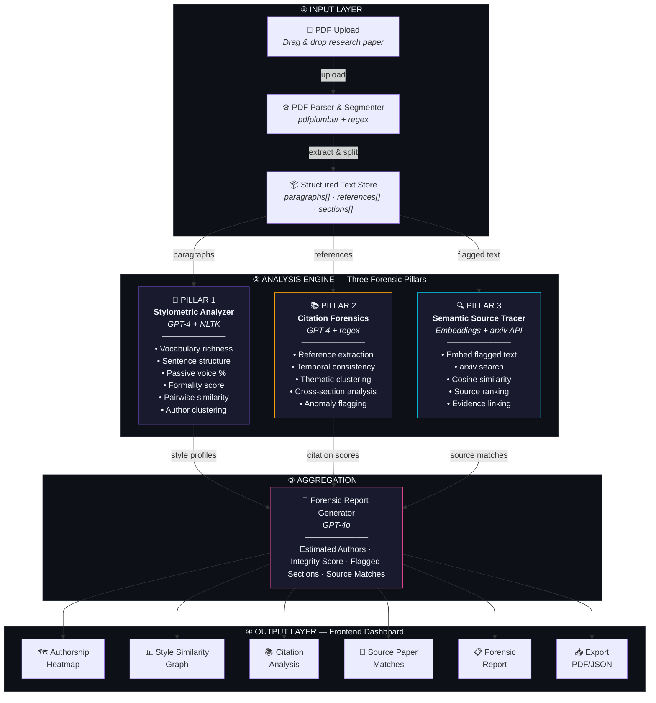
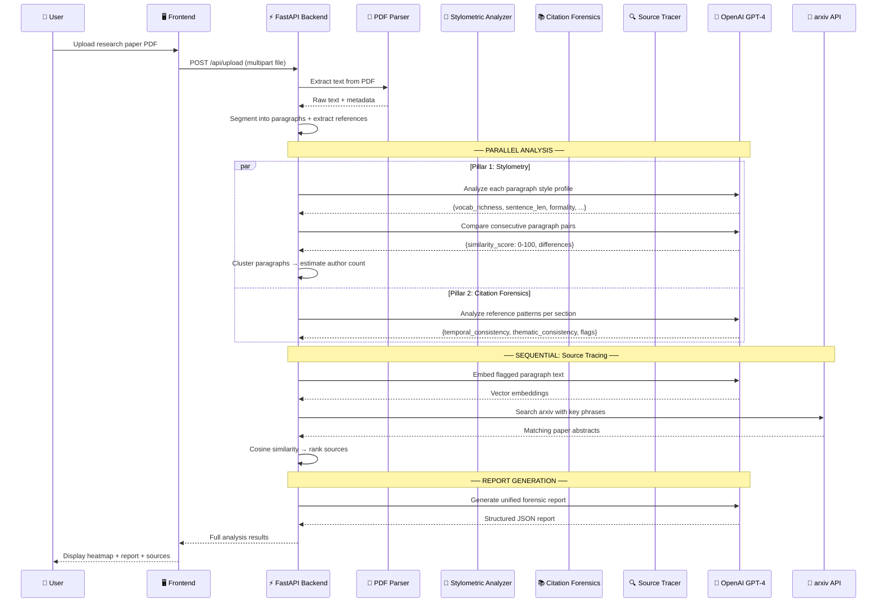
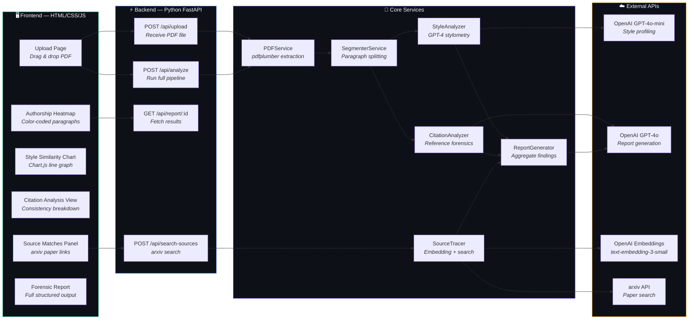
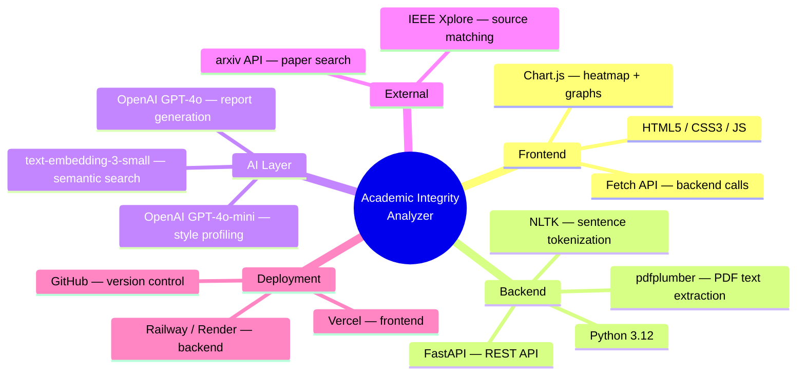
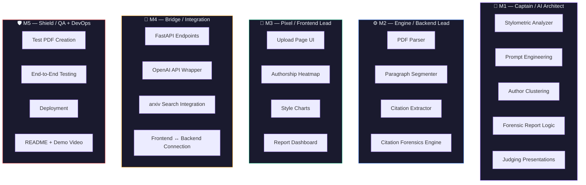

# 🔬 Academic Integrity Analyzer — System Design

> **PS2 | DevClash 2026 | Open Track**  
> Detects stitched plagiarism through stylometric analysis, citation forensics, and semantic source tracing

---

## 🏗️ Architecture Diagram

```
╔══════════════════════════════════════════════════════════════════════════════════════════════╗
║                        ACADEMIC INTEGRITY ANALYZER — SYSTEM ARCHITECTURE                     ║
║                     Stitched Plagiarism Detection via AI-Powered Forensics                    ║
╠══════════════════════════════════════════════════════════════════════════════════════════════╣
║                                                                                              ║
║  ┌─────────────────────────────────── ① INPUT LAYER ───────────────────────────────────────┐ ║
║  │                                                                                         │ ║
║  │   👤 User                    ⚙️ PDF Parser                   📦 Text Store              │ ║
║  │   ┌──────────────┐           ┌──────────────────┐           ┌──────────────────┐        │ ║
║  │   │  📄 Upload   │  ──POST──▶│  pdfplumber      │  ──────▶  │  paragraphs[]    │        │ ║
║  │   │  Research    │  /api/    │  + regex          │           │  references[]    │        │ ║
║  │   │  Paper PDF   │  upload   │                  │           │  sections[]      │        │ ║
║  │   │              │           │  • Text extract   │           │  metadata{}      │        │ ║
║  │   │  [Drag&Drop] │           │  • Para splitting │           │                  │        │ ║
║  │   │  [M3-Pixel]  │           │  • Ref extraction │           │  [In-Memory]     │        │ ║
║  │   └──────────────┘           │  [M2-Engine]      │           └────────┬─────────┘        │ ║
║  │                              └──────────────────┘                     │                  │ ║
║  └──────────────────────────────────────────────────────────────────────┼──────────────────┘ ║
║                                                                         │                    ║
║                              ┌──────────────────────────────────────────┼───┐                ║
║                              │                  │                       │   │                ║
║                              ▼                  ▼                       ▼   │                ║
║  ┌──────────────────── ② ANALYSIS ENGINE — THREE FORENSIC PILLARS ─────────────────────────┐ ║
║  │                                                                                         │ ║
║  │  ┌─── PILLAR 1 ──────────┐  ┌─── PILLAR 2 ──────────┐  ┌─── PILLAR 3 ──────────┐     │ ║
║  │  │ 🔬 STYLOMETRIC        │  │ 📚 CITATION            │  │ 🔍 SEMANTIC SOURCE     │     │ ║
║  │  │    ANALYZER            │  │    FORENSICS            │  │    TRACER              │     │ ║
║  │  │ ─────────────────────  │  │ ─────────────────────   │  │ ─────────────────────  │     │ ║
║  │  │ • Vocabulary richness  │  │ • Reference extraction  │  │ • Embed flagged text   │     │ ║
║  │  │ • Sentence structure   │  │ • Temporal analysis     │  │ • Query arxiv API      │     │ ║
║  │  │ • Passive voice %      │  │   (cite era mismatch)   │  │ • Cosine similarity    │     │ ║
║  │  │ • Formality score      │  │ • Thematic clustering   │  │ • Rank source papers   │     │ ║
║  │  │ • Technical density    │  │   (topic consistency)   │  │ • Evidence linking      │     │ ║
║  │  │ • Hedging frequency    │  │ • Cross-section scoring │  │   (section → paper)    │     │ ║
║  │  │ • Pairwise comparison  │  │ • Anomaly flagging      │  │                        │     │ ║
║  │  │   (consecutive pairs)  │  │                         │  │ ┌────────────────────┐ │     │ ║
║  │  │ • Author clustering    │  │ ┌─────────────────────┐ │  │ │ ☁️ arxiv API       │ │     │ ║
║  │  │                        │  │ │ ☁️ OpenAI GPT-4o    │ │  │ │ ☁️ Embeddings API  │ │     │ ║
║  │  │ ┌────────────────────┐ │  │ │    (forensics)      │ │  │ │  text-embedding-   │ │     │ ║
║  │  │ │ ☁️ OpenAI          │ │  │ └─────────────────────┘ │  │ │  3-small           │ │     │ ║
║  │  │ │  GPT-4o-mini       │ │  │                         │  │ └────────────────────┘ │     │ ║
║  │  │ │  (per-paragraph)   │ │  │ Owner: [M2-Engine]      │  │                        │     │ ║
║  │  │ │ ☁️ NLTK / spaCy   │ │  │ Priority: 🔴 P0 Core   │  │ Owner: [M4-Bridge]     │     │ ║
║  │  │ │  (tokenization)    │ │  │                         │  │ Priority: 🟡 P1        │     │ ║
║  │  │ └────────────────────┘ │  └─────────────────────────┘  └────────────────────────┘     │ ║
║  │  │                        │                                                              │ ║
║  │  │ Owner: [M1-Captain]    │         ║ style       ║ citation     ║ source                │ ║
║  │  │ Priority: 🔴 P0 Core  │         ║ profiles    ║ scores       ║ matches               │ ║
║  │  └────────────────────────┘         ▼             ▼              ▼                       │ ║
║  └─────────────────────────────────────────────────────────────────────────────────────────┘ ║
║                                                │                                             ║
║                                                ▼                                             ║
║  ┌──────────────────────────────── ③ AGGREGATION LAYER ───────────────────────────────────┐  ║
║  │                                                                                        │  ║
║  │                        🧠 FORENSIC REPORT GENERATOR                                    │  ║
║  │                        OpenAI GPT-4o · Structured JSON                                 │  ║
║  │                        Owner: [M1-Captain]                                             │  ║
║  │                                                                                        │  ║
║  │   ┌──────────────┐  ┌──────────────┐  ┌──────────────┐  ┌──────────────┐              │  ║
║  │   │  N Estimated  │  │  X/10        │  │  K Flagged    │  │  M Source     │              │  ║
║  │   │  Authors      │  │  Integrity   │  │  Sections     │  │  Matches      │              │  ║
║  │   │              │  │  Score        │  │              │  │  Found        │              │  ║
║  │   └──────────────┘  └──────────────┘  └──────────────┘  └──────────────┘              │  ║
║  │                                                                                        │  ║
║  └────────────────────────────────────────┬───────────────────────────────────────────────┘  ║
║                                           │                                                  ║
║                                           ▼                                                  ║
║  ┌──────────────────────── ④ OUTPUT LAYER — Frontend Dashboard ───────────────────────────┐  ║
║  │                                     Owner: [M3-Pixel]                                  │  ║
║  │                                                                                        │  ║
║  │  ┌────────────┐ ┌────────────┐ ┌────────────┐ ┌────────────┐ ┌──────────┐ ┌─────────┐ │  ║
║  │  │ 🗺️ Author- │ │ 📊 Style   │ │ 📚 Citation│ │ 🔗 Source  │ │ 📋 Full  │ │ 📥 Exp- │ │  ║
║  │  │ ship Heat- │ │ Similarity │ │ Analysis   │ │ Paper      │ │ Forensic │ │ ort     │ │  ║
║  │  │ map        │ │ Graph      │ │ View       │ │ Matches    │ │ Report   │ │ PDF/JSON│ │  ║
║  │  │            │ │            │ │            │ │            │ │          │ │         │ │  ║
║  │  │ Color-code │ │ Line chart │ │ Temporal & │ │ Flagged    │ │ Authors, │ │ Downloa-│ │  ║
║  │  │ paragraphs │ │ of para    │ │ thematic   │ │ section →  │ │ scores,  │ │ dable   │ │  ║
║  │  │ by inferred│ │ similarity │ │ consistency│ │ arxiv paper│ │ verdicts,│ │ for     │ │  ║
║  │  │ author     │ │ scores     │ │ breakdown  │ │ with % sim │ │ evidence │ │ records │ │  ║
║  │  └────────────┘ └────────────┘ └────────────┘ └────────────┘ └──────────┘ └─────────┘ │  ║
║  └────────────────────────────────────────────────────────────────────────────────────────┘  ║
║                                                                                              ║
╠══════════════════════════════════════════════════════════════════════════════════════════════╣
║                                                                                              ║
║  ⚡ API ENDPOINTS (FastAPI · M4-Bridge)          ☁️ EXTERNAL SERVICES                        ║
║  ──────────────────────────────────────          ─────────────────────                        ║
║  POST  /api/upload         → Receive PDF         OpenAI GPT-4o-mini  → Style profiling       ║
║  POST  /api/analyze        → Run full pipeline   OpenAI GPT-4o       → Report generation     ║
║  GET   /api/report/{id}    → Fetch results       OpenAI Embeddings   → Semantic vectors      ║
║  POST  /api/search-sources → arxiv search        arxiv API           → Paper search           ║
║                                                  NLTK / spaCy        → Tokenization           ║
║                                                                                              ║
║  🛠️ TECH STACK                                   👥 TEAM OWNERSHIP                           ║
║  ──────────────                                  ─────────────────                             ║
║  Frontend:  HTML/CSS/JS + Chart.js               M1 (Captain): AI prompts, stylometry, report ║
║  Backend:   Python 3.12 + FastAPI                M2 (Engine):  PDF parser, citation forensics ║
║  AI:        OpenAI GPT-4 + Embeddings            M3 (Pixel):   Frontend, heatmap, dashboard   ║
║  PDF:       pdfplumber + PyPDF2                  M4 (Bridge):  FastAPI, arxiv, integration     ║
║  Deploy:    Railway/Render + Vercel              M5 (Shield):  Testing, deploy, README, video ║
║                                                                                              ║
║  💰 COST: ~$0.15 per paper analysis    ⏱️ LATENCY: ~30-60s end-to-end                       ║
║                                                                                              ║
╚══════════════════════════════════════════════════════════════════════════════════════════════╝
```

---

## High-Level Architecture



---

## Detailed Data Flow



---

## Component Architecture



---

## Tech Stack



---

## Team Ownership Map



---

## Project Structure

```
academic-integrity-analyzer/
├── backend/
│   ├── main.py                  # FastAPI app entry point
│   ├── routers/
│   │   ├── upload.py            # POST /api/upload
│   │   ├── analyze.py           # POST /api/analyze
│   │   ├── report.py            # GET /api/report/:id
│   │   └── sources.py           # POST /api/search-sources
│   ├── services/
│   │   ├── pdf_service.py       # PDF parsing + text extraction
│   │   ├── segmenter.py         # Paragraph segmentation
│   │   ├── style_analyzer.py    # Stylometric analysis (GPT-4)
│   │   ├── citation_analyzer.py # Citation forensics
│   │   ├── source_tracer.py     # Semantic search + arxiv
│   │   └── report_generator.py  # Aggregate forensic report
│   ├── models/
│   │   ├── paragraph.py         # Paragraph data model
│   │   ├── analysis.py          # Analysis result models
│   │   └── report.py            # Forensic report model
│   ├── prompts/
│   │   ├── style_profile.txt    # GPT-4 style analysis prompt
│   │   ├── style_compare.txt    # Pairwise comparison prompt
│   │   ├── citation_analysis.txt # Citation forensics prompt
│   │   └── report_gen.txt       # Report generation prompt
│   └── requirements.txt
├── frontend/
│   ├── index.html               # Main page
│   ├── css/
│   │   └── styles.css           # Dark theme styling
│   └── js/
│       ├── app.js               # Main app logic
│       ├── upload.js            # File upload handler
│       ├── heatmap.js           # Authorship heatmap renderer
│       ├── charts.js            # Style similarity charts
│       └── report.js            # Report display logic
├── tests/
│   ├── test_genuine.pdf         # Single-author paper (should pass)
│   ├── test_stitched.pdf        # Multi-source stitched paper (should flag)
│   └── test_collaborative.pdf   # Legit multi-author (should show variation)
├── README.md
└── .gitignore
```

---

## Key Design Decisions

| Decision | Choice | Rationale |
|----------|--------|-----------|
| **AI Model** | GPT-4o-mini for per-paragraph, GPT-4o for final report | Cost efficiency — bulk work uses cheaper model, synthesis uses smarter model |
| **PDF Parser** | pdfplumber over PyPDF2 | Better layout preservation, handles tables/columns correctly |
| **Clustering** | LLM-driven over k-means | Writing style is semantic — can't reduce to numeric features alone |
| **Source Search** | arxiv API + embeddings | Free, real-time, covers CS/ML papers. IEEE as stretch goal |
| **Frontend** | Vanilla HTML/CSS/JS | Zero build step, instant deploy, team knows it well |
| **Backend** | FastAPI | Native async, auto-docs, Python ecosystem for NLP |

---

## API Cost Per Analysis

| Step | API Call | Model | Est. Cost |
|------|---------|-------|-----------|
| Style per paragraph (×40) | 40 calls | gpt-4o-mini | ~$0.02 |
| Pairwise comparison (×39) | 39 calls | gpt-4o-mini | ~$0.02 |
| Citation forensics | 1 call | gpt-4o | ~$0.03 |
| Author estimation | 1 call | gpt-4o | ~$0.03 |
| Report generation | 1 call | gpt-4o | ~$0.05 |
| Embeddings (×10 flagged) | 10 calls | text-embedding-3-small | ~$0.001 |
| **TOTAL** | | | **~$0.15** |
