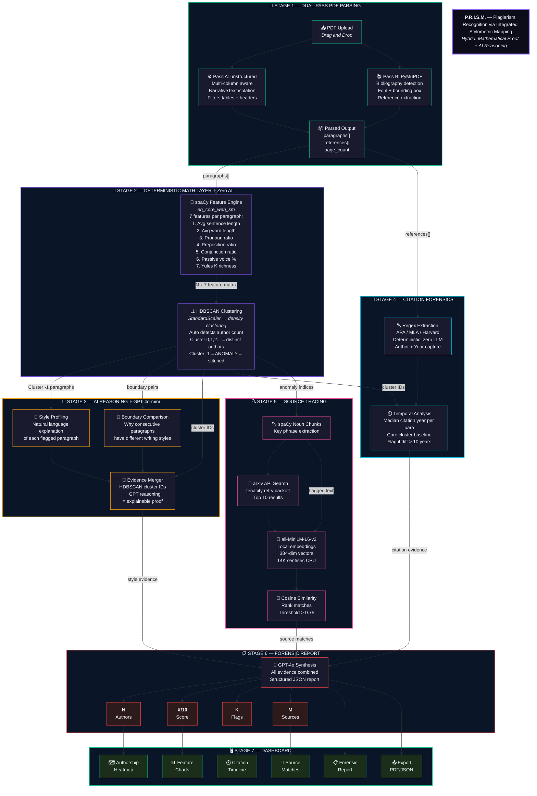

```mermaid
graph TB
    TITLE["<b>P.R.I.S.M.</b> — Plagiarism Recognition via Integrated Stylometric Mapping<br/><i>Hybrid: Mathematical Proof + AI Reasoning</i>"]

    subgraph S1["📄 STAGE 1 — DUAL-PASS PDF PARSING"]
        direction LR
        A["📤 PDF Upload<br/><i>Drag and Drop</i>"]
        B["⚙️ Pass A: unstructured<br/>Multi-column aware<br/>NarrativeText isolation<br/>Filters tables + headers"]
        C["📚 Pass B: PyMuPDF<br/>Bibliography detection<br/>Font + bounding box<br/>Reference extraction"]
        D["📦 Parsed Output<br/>paragraphs[]<br/>references[]<br/>page_count"]
    end

    A --> B
    A --> C
    B --> D
    C --> D

    subgraph S2["🔬 STAGE 2 — DETERMINISTIC MATH LAYER ⚡ Zero AI"]
        direction TB
        E["🧪 spaCy Feature Engine<br/><i>en_core_web_sm</i><br/>7 features per paragraph:<br/>1. Avg sentence length<br/>2. Avg word length<br/>3. Pronoun ratio<br/>4. Preposition ratio<br/>5. Conjunction ratio<br/>6. Passive voice %<br/>7. Yules K richness"]
        F["📊 HDBSCAN Clustering<br/><i>StandardScaler → density clustering</i><br/>Auto detects author count<br/>Cluster 0,1,2... = distinct authors<br/>Cluster -1 = ANOMALY = stitched"]
    end

    D -->|"paragraphs[]"| E
    E -->|"N x 7 feature matrix"| F

    subgraph S3["🤖 STAGE 3 — AI REASONING ⚡ GPT-4o-mini"]
        direction TB
        G["💬 Style Profiling<br/>Natural language explanation<br/>of each flagged paragraph"]
        H["🔀 Boundary Comparison<br/>Why consecutive paragraphs<br/>have different writing styles"]
        I["🔗 Evidence Merger<br/>HDBSCAN cluster IDs<br/>+ GPT reasoning<br/>= explainable proof"]
    end

    F -->|"Cluster -1 paragraphs"| G
    F -->|"boundary pairs"| H
    G --> I
    H --> I
    F -->|"cluster IDs"| I

    subgraph S4["📝 STAGE 4 — CITATION FORENSICS"]
        direction TB
        J["🔤 Regex Extraction<br/>APA / MLA / Harvard<br/>Deterministic, zero LLM<br/>Author + Year capture"]
        K["⏱️ Temporal Analysis<br/>Median citation year per para<br/>Core cluster baseline<br/>Flag if diff > 10 years"]
    end

    D -->|"references[]"| J
    J --> K
    F -->|"cluster IDs"| K

    subgraph S5["🔍 STAGE 5 — SOURCE TRACING"]
        direction TB
        L["🏷️ spaCy Noun Chunks<br/>Key phrase extraction"]
        M["📑 arxiv API Search<br/>tenacity retry backoff<br/>Top 10 results"]
        N["🧠 all-MiniLM-L6-v2<br/>Local embeddings<br/>384-dim vectors<br/>14K sent/sec CPU"]
        O["📐 Cosine Similarity<br/>Rank matches<br/>Threshold > 0.75"]
    end

    F -->|"anomaly indices"| L
    L --> M
    M --> N
    L -->|"flagged text"| N
    N --> O

    subgraph S6["📋 STAGE 6 — FORENSIC REPORT"]
        direction LR
        P["🧠 GPT-4o Synthesis<br/>All evidence combined<br/>Structured JSON report"]
        Q["<b>N</b><br/>Authors"]
        R["<b>X/10</b><br/>Score"]
        S["<b>K</b><br/>Flags"]
        T["<b>M</b><br/>Sources"]
    end

    I -->|"style evidence"| P
    K -->|"citation evidence"| P
    O -->|"source matches"| P
    P --> Q
    P --> R
    P --> S
    P --> T

    subgraph S7["🖥️ STAGE 7 — DASHBOARD"]
        direction LR
        U["🗺️ Authorship<br/>Heatmap"]
        V["📊 Feature<br/>Charts"]
        W["⏱️ Citation<br/>Timeline"]
        X["🔗 Source<br/>Matches"]
        Y["📋 Forensic<br/>Report"]
        Z["📥 Export<br/>PDF/JSON"]
    end

    Q --> U
    R --> V
    S --> W
    T --> X
    P --> Y
    P --> Z

    style TITLE fill:#0d0d1a,stroke:#8b5cf6,color:#f0f6fc,stroke-width:3px
    style S1 fill:#0a1628,stroke:#10b981,color:#f0f6fc,stroke-width:2px
    style S2 fill:#0a1628,stroke:#8b5cf6,color:#f0f6fc,stroke-width:2px
    style S3 fill:#0a1628,stroke:#f59e0b,color:#f0f6fc,stroke-width:2px
    style S4 fill:#0a1628,stroke:#06b6d4,color:#f0f6fc,stroke-width:2px
    style S5 fill:#0a1628,stroke:#ec4899,color:#f0f6fc,stroke-width:2px
    style S6 fill:#0a1628,stroke:#ef4444,color:#f0f6fc,stroke-width:2px
    style S7 fill:#0a1628,stroke:#10b981,color:#f0f6fc,stroke-width:2px

    style A fill:#1a1a2e,stroke:#10b981,color:#f0f6fc
    style B fill:#1a1a2e,stroke:#10b981,color:#f0f6fc
    style C fill:#1a1a2e,stroke:#10b981,color:#f0f6fc
    style D fill:#1a1a2e,stroke:#10b981,color:#f0f6fc

    style E fill:#1a1a2e,stroke:#8b5cf6,color:#f0f6fc
    style F fill:#1a1a2e,stroke:#8b5cf6,color:#f0f6fc

    style G fill:#1a1a2e,stroke:#f59e0b,color:#f0f6fc
    style H fill:#1a1a2e,stroke:#f59e0b,color:#f0f6fc
    style I fill:#1a1a2e,stroke:#f59e0b,color:#f0f6fc

    style J fill:#1a1a2e,stroke:#06b6d4,color:#f0f6fc
    style K fill:#1a1a2e,stroke:#06b6d4,color:#f0f6fc

    style L fill:#1a1a2e,stroke:#ec4899,color:#f0f6fc
    style M fill:#1a1a2e,stroke:#ec4899,color:#f0f6fc
    style N fill:#1a1a2e,stroke:#ec4899,color:#f0f6fc
    style O fill:#1a1a2e,stroke:#ec4899,color:#f0f6fc

    style P fill:#1a1a2e,stroke:#ef4444,color:#f0f6fc
    style Q fill:#2d1a1a,stroke:#ef4444,color:#f0f6fc
    style R fill:#2d1a1a,stroke:#ef4444,color:#f0f6fc
    style S fill:#2d1a1a,stroke:#ef4444,color:#f0f6fc
    style T fill:#2d1a1a,stroke:#ef4444,color:#f0f6fc

    style U fill:#1a2e1a,stroke:#10b981,color:#f0f6fc
    style V fill:#1a2e1a,stroke:#10b981,color:#f0f6fc
    style W fill:#1a2e1a,stroke:#10b981,color:#f0f6fc
    style X fill:#1a2e1a,stroke:#10b981,color:#f0f6fc
    style Y fill:#1a2e1a,stroke:#10b981,color:#f0f6fc
    style Z fill:#1a2e1a,stroke:#10b981,color:#f0f6fc
```
