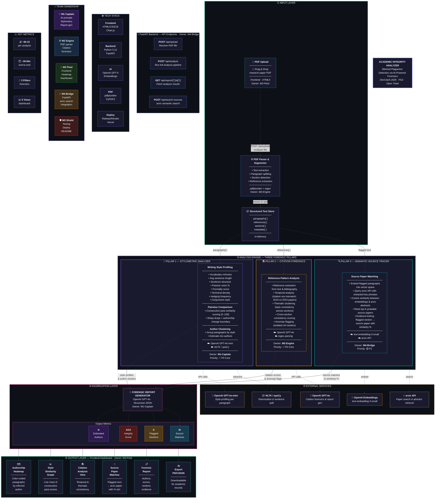

# Mermaid Diagram — Paste this into https://mermaid.live

```mermaid
graph TB
    %% ============================================
    %% TITLE
    %% ============================================

    title["<b>ACADEMIC INTEGRITY ANALYZER</b><br/>Stitched Plagiarism Detection via AI-Powered Forensics<br/><i>DevClash 2026 · PS2 · Open Track</i>"]
    style title fill:#1a1a2e,stroke:#6366f1,color:#f0f6fc,stroke-width:2px

    %% ============================================
    %% ① INPUT LAYER
    %% ============================================

    subgraph INPUT["① INPUT LAYER"]
        direction LR
        A["👤 <b>PDF Upload</b><br/>─────────────<br/>📄 Drag & Drop<br/>research paper PDF<br/>─────────────<br/><i>Frontend · HTML5</i><br/><i>Owner: M3-Pixel</i>"]
        B["⚙️ <b>PDF Parser & Segmenter</b><br/>─────────────<br/>• Text extraction<br/>• Paragraph splitting<br/>• Section detection<br/>• Reference extraction<br/>─────────────<br/><i>pdfplumber + regex</i><br/><i>Owner: M2-Engine</i>"]
        C["📦 <b>Structured Text Store</b><br/>─────────────<br/>paragraphs[ ]<br/>references[ ]<br/>sections[ ]<br/>metadata{ }<br/>─────────────<br/><i>In-Memory</i>"]
    end

    A -->|"POST /api/upload<br/>multipart file"| B
    B -->|"extract & split"| C

    %% ============================================
    %% ② ANALYSIS ENGINE — THREE FORENSIC PILLARS
    %% ============================================

    subgraph ENGINE["② ANALYSIS ENGINE — THREE FORENSIC PILLARS"]
        direction LR

        subgraph P1["🔬 PILLAR 1 — STYLOMETRIC ANALYZER"]
            D["<b>Writing Style Profiling</b><br/>─────────────────────<br/>• Vocabulary richness<br/>• Avg sentence length<br/>• Sentence structure<br/>• Passive voice %<br/>• Formality score<br/>• Technical density<br/>• Hedging frequency<br/>• Conjunction style<br/>─────────────────────<br/><b>Pairwise Comparison</b><br/>• Consecutive para similarity<br/>  scoring (0–100)<br/>• Sharp drops = authorship<br/>  change boundary<br/>─────────────────────<br/><b>Author Clustering</b><br/>• Group paragraphs by style<br/>• Estimate min authors<br/>─────────────────────<br/>☁️ <i>OpenAI GPT-4o-mini</i><br/>☁️ <i>NLTK / spaCy</i><br/>─────────────────────<br/>Owner: <b>M1-Captain</b><br/>Priority: 🔴 P0 Core"]
        end

        subgraph P2["📚 PILLAR 2 — CITATION FORENSICS"]
            E["<b>Reference Pattern Analysis</b><br/>─────────────────────<br/>• Reference extraction<br/>  from text & bibliography<br/>• Temporal analysis<br/>  (citation era mismatch:<br/>   2019 vs 2024 papers)<br/>• Thematic clustering<br/>  (topic consistency<br/>   across sections)<br/>• Cross-section<br/>  consistency scoring<br/>• Anomaly flagging<br/>  (isolated ref clusters)<br/>─────────────────────<br/>☁️ <i>OpenAI GPT-4o</i><br/>☁️ <i>regex parsing</i><br/>─────────────────────<br/>Owner: <b>M2-Engine</b><br/>Priority: 🔴 P0 Core"]
        end

        subgraph P3["🔍 PILLAR 3 — SEMANTIC SOURCE TRACER"]
            F["<b>Source Paper Matching</b><br/>─────────────────────<br/>• Embed flagged paragraphs<br/>  into vector space<br/>• Query arxiv API with<br/>  extracted key phrases<br/>• Cosine similarity between<br/>  embeddings & arxiv<br/>  abstracts<br/>• Rank top-K probable<br/>  source papers<br/>• Evidence linking:<br/>  flagged section →<br/>  source paper with<br/>  similarity %<br/>─────────────────────<br/>☁️ <i>text-embedding-3-small</i><br/>☁️ <i>arxiv API</i><br/>─────────────────────<br/>Owner: <b>M4-Bridge</b><br/>Priority: 🟡 P1"]
        end
    end

    C -->|"paragraphs[ ]"| D
    C -->|"references[ ]"| E
    C -->|"flagged text"| F

    %% ============================================
    %% ③ AGGREGATION LAYER
    %% ============================================

    subgraph AGG["③ AGGREGATION LAYER"]
        G["🧠 <b>FORENSIC REPORT GENERATOR</b><br/>OpenAI GPT-4o · Structured JSON<br/>Owner: M1-Captain"]
        subgraph METRICS["Output Metrics"]
            direction LR
            G1["<b>N</b><br/>Estimated<br/>Authors"]
            G2["<b>X/10</b><br/>Integrity<br/>Score"]
            G3["<b>K</b><br/>Flagged<br/>Sections"]
            G4["<b>M</b><br/>Source<br/>Matches"]
        end
    end

    D -->|"style profiles<br/>& author clusters"| G
    E -->|"citation scores<br/>& anomaly flags"| G
    F -->|"source matches<br/>& similarity %"| G
    G --> G1
    G --> G2
    G --> G3
    G --> G4

    %% ============================================
    %% ④ OUTPUT LAYER — Frontend Dashboard
    %% ============================================

    subgraph OUTPUT["④ OUTPUT LAYER — Frontend Dashboard · Owner: M3-Pixel"]
        direction LR
        H["🗺️<br/><b>Authorship<br/>Heatmap</b><br/>─────────<br/>Color-coded<br/>paragraphs<br/>by inferred<br/>author"]
        I["📊<br/><b>Style<br/>Similarity<br/>Graph</b><br/>─────────<br/>Line chart of<br/>consecutive<br/>para scores"]
        J["📚<br/><b>Citation<br/>Analysis<br/>View</b><br/>─────────<br/>Temporal &<br/>thematic<br/>consistency"]
        K["🔗<br/><b>Source<br/>Paper<br/>Matches</b><br/>─────────<br/>Flagged sect<br/>→ arxiv paper<br/>with % sim"]
        L["📋<br/><b>Forensic<br/>Report</b><br/>─────────<br/>Authors,<br/>scores,<br/>verdicts,<br/>evidence"]
        M["📥<br/><b>Export<br/>PDF/JSON</b><br/>─────────<br/>Downloadable<br/>for academic<br/>records"]
    end

    METRICS --> H
    METRICS --> I
    METRICS --> J
    METRICS --> K
    METRICS --> L
    METRICS --> M

    %% ============================================
    %% ⑤ EXTERNAL SERVICES
    %% ============================================

    subgraph EXT["⑤ EXTERNAL SERVICES"]
        direction LR
        X1["🤖 <b>OpenAI GPT-4o-mini</b><br/><i>Style profiling per paragraph</i>"]
        X2["🤖 <b>OpenAI GPT-4o</b><br/><i>Citation forensics & report gen</i>"]
        X3["🤖 <b>OpenAI Embeddings</b><br/><i>text-embedding-3-small</i>"]
        X4["📑 <b>arxiv API</b><br/><i>Paper search & abstract retrieval</i>"]
        X5["📦 <b>NLTK / spaCy</b><br/><i>Tokenization & sentence split</i>"]
    end

    D -.->|"API calls"| X1
    D -.->|"tokenize"| X5
    E -.->|"API calls"| X2
    F -.->|"embed"| X3
    F -.->|"search"| X4

    %% ============================================
    %% ⚡ API ENDPOINTS
    %% ============================================

    subgraph API["⚡ FastAPI Backend — API Endpoints · Owner: M4-Bridge"]
        direction LR
        R1["<b>POST</b> /api/upload<br/><i>Receive PDF file</i>"]
        R2["<b>POST</b> /api/analyze<br/><i>Run full analysis pipeline</i>"]
        R3["<b>GET</b> /api/report/{'{'}id{'}'}<br/><i>Fetch analysis results</i>"]
        R4["<b>POST</b> /api/search-sources<br/><i>arxiv semantic search</i>"]
    end

    %% ============================================
    %% TECH STACK & META
    %% ============================================

    subgraph TECH["🛠️ TECH STACK"]
        direction LR
        T1["<b>Frontend</b><br/>HTML/CSS/JS<br/>Chart.js"]
        T2["<b>Backend</b><br/>Python 3.12<br/>FastAPI"]
        T3["<b>AI</b><br/>OpenAI GPT-4<br/>Embeddings"]
        T4["<b>PDF</b><br/>pdfplumber<br/>PyPDF2"]
        T5["<b>Deploy</b><br/>Railway/Render<br/>Vercel"]
    end

    subgraph TEAM["👥 TEAM OWNERSHIP"]
        direction LR
        TM1["🎯 <b>M1 Captain</b><br/>AI prompts<br/>Stylometry<br/>Report gen"]
        TM2["⚙️ <b>M2 Engine</b><br/>PDF parser<br/>Citation<br/>forensics"]
        TM3["🎨 <b>M3 Pixel</b><br/>Frontend<br/>Heatmap<br/>Dashboard"]
        TM4["🔗 <b>M4 Bridge</b><br/>FastAPI<br/>arxiv search<br/>Integration"]
        TM5["🛡️ <b>M5 Shield</b><br/>Testing<br/>Deploy<br/>README"]
    end

    subgraph STATS["📈 KEY METRICS"]
        direction LR
        S1["💰 <b>~$0.15</b><br/>per analysis"]
        S2["⏱️ <b>~30-60s</b><br/>end-to-end"]
        S3["🔬 <b>3 Pillars</b><br/>forensics"]
        S4["📊 <b>6 Views</b><br/>dashboard"]
    end

    %% ============================================
    %% STYLES
    %% ============================================

    style INPUT fill:#0d1117,stroke:#10b981,color:#f0f6fc,stroke-width:2px
    style ENGINE fill:#0d1117,stroke:#8b5cf6,color:#f0f6fc,stroke-width:2px
    style P1 fill:#1a1a2e,stroke:#8b5cf6,color:#f0f6fc,stroke-width:2px
    style P2 fill:#1a1a2e,stroke:#f59e0b,color:#f0f6fc,stroke-width:2px
    style P3 fill:#1a1a2e,stroke:#06b6d4,color:#f0f6fc,stroke-width:2px
    style AGG fill:#0d1117,stroke:#ec4899,color:#f0f6fc,stroke-width:2px
    style METRICS fill:#1a1a2e,stroke:#ec4899,color:#f0f6fc
    style OUTPUT fill:#0d1117,stroke:#10b981,color:#f0f6fc,stroke-width:2px
    style EXT fill:#0d1117,stroke:#f59e0b,color:#f0f6fc,stroke-width:1px,stroke-dasharray:5
    style API fill:#0d1117,stroke:#3b82f6,color:#f0f6fc,stroke-width:1px,stroke-dasharray:5
    style TECH fill:#0d1117,stroke:#6366f1,color:#f0f6fc,stroke-width:1px
    style TEAM fill:#0d1117,stroke:#6366f1,color:#f0f6fc,stroke-width:1px
    style STATS fill:#0d1117,stroke:#6366f1,color:#f0f6fc,stroke-width:1px

    style A fill:#1a1a2e,stroke:#10b981,color:#f0f6fc
    style B fill:#1a1a2e,stroke:#3b82f6,color:#f0f6fc
    style C fill:#1a1a2e,stroke:#8b5cf6,color:#f0f6fc
    style D fill:#1a1a2e,stroke:#8b5cf6,color:#f0f6fc
    style E fill:#1a1a2e,stroke:#f59e0b,color:#f0f6fc
    style F fill:#1a1a2e,stroke:#06b6d4,color:#f0f6fc
    style G fill:#1a1a2e,stroke:#ec4899,color:#f0f6fc
    style G1 fill:#2d1a4e,stroke:#8b5cf6,color:#f0f6fc
    style G2 fill:#4e1a1a,stroke:#ef4444,color:#f0f6fc
    style G3 fill:#4e3a1a,stroke:#f59e0b,color:#f0f6fc
    style G4 fill:#1a3a4e,stroke:#06b6d4,color:#f0f6fc
    style H fill:#1a1a2e,stroke:#10b981,color:#f0f6fc
    style I fill:#1a1a2e,stroke:#10b981,color:#f0f6fc
    style J fill:#1a1a2e,stroke:#10b981,color:#f0f6fc
    style K fill:#1a1a2e,stroke:#10b981,color:#f0f6fc
    style L fill:#1a1a2e,stroke:#10b981,color:#f0f6fc
    style M fill:#1a1a2e,stroke:#10b981,color:#f0f6fc

    style X1 fill:#1a1a2e,stroke:#f59e0b,color:#f0f6fc
    style X2 fill:#1a1a2e,stroke:#f59e0b,color:#f0f6fc
    style X3 fill:#1a1a2e,stroke:#f59e0b,color:#f0f6fc
    style X4 fill:#1a1a2e,stroke:#f59e0b,color:#f0f6fc
    style X5 fill:#1a1a2e,stroke:#f59e0b,color:#f0f6fc

    style R1 fill:#1a1a2e,stroke:#3b82f6,color:#f0f6fc
    style R2 fill:#1a1a2e,stroke:#3b82f6,color:#f0f6fc
    style R3 fill:#1a1a2e,stroke:#3b82f6,color:#f0f6fc
    style R4 fill:#1a1a2e,stroke:#3b82f6,color:#f0f6fc

    style T1 fill:#1a1a2e,stroke:#6366f1,color:#f0f6fc
    style T2 fill:#1a1a2e,stroke:#6366f1,color:#f0f6fc
    style T3 fill:#1a1a2e,stroke:#6366f1,color:#f0f6fc
    style T4 fill:#1a1a2e,stroke:#6366f1,color:#f0f6fc
    style T5 fill:#1a1a2e,stroke:#6366f1,color:#f0f6fc

    style TM1 fill:#2d1a4e,stroke:#8b5cf6,color:#f0f6fc
    style TM2 fill:#1a2a3e,stroke:#3b82f6,color:#f0f6fc
    style TM3 fill:#1a2e1a,stroke:#10b981,color:#f0f6fc
    style TM4 fill:#3e2e1a,stroke:#f59e0b,color:#f0f6fc
    style TM5 fill:#3e1a1a,stroke:#ef4444,color:#f0f6fc

    style S1 fill:#1a1a2e,stroke:#6366f1,color:#f0f6fc
    style S2 fill:#1a1a2e,stroke:#6366f1,color:#f0f6fc
    style S3 fill:#1a1a2e,stroke:#6366f1,color:#f0f6fc
    style S4 fill:#1a1a2e,stroke:#6366f1,color:#f0f6fc
```
