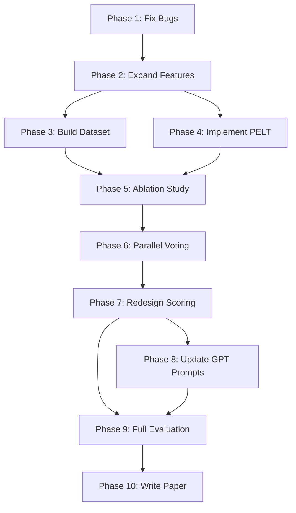

# P.R.I.S.M. v2 — Complete Redesign Implementation Plan

> **Status:** Awaiting user approval before execution.

## Summary

This plan redesigns P.R.I.S.M. based on 18 design decisions resolved through systematic interrogation. The core changes: add PELT change-point detection alongside HDBSCAN (parallel voting architecture), expand the feature space and ablate to the top ~20 features, separate semantic embeddings into an independent topic coherence stream, redesign the scoring system with calibrated weights, and validate everything against PAN datasets + synthetic benchmarks.

---

## All 18 Resolved Design Decisions

| # | Decision | Resolution |
|:---:|:---|:---|
| 1 | Primary objective | Both authorship clustering AND boundary detection |
| 2 | Minimum paragraph size | Tiered: <50 words skip, 50-100 reduced features, ≥100 full |
| 3 | Dual-engine architecture | Parallel voting — HDBSCAN + PELT, confidence tiers |
| 4 | Granularity | Paragraph-level |
| 5 | Feature selection | Expand candidates, ablate to top ~20 |
| 6 | Semantic embeddings | Separate evidence stream, NOT in clustering |
| 7 | Topic coherence | Adjacent MiniLM cosine similarity, flag drops < mean−2σ |
| 8 | Scoring system | 4-tier verdict, weighted sub-score average |
| 9 | GPT role | Stays for reasoning + reports, doesn't affect score |
| 10 | Idea Triplets | Source tracing only, fix parser bug |
| 11 | Burstiness | Soft feature only, remove hard threshold + penalty |
| 12 | Citations | Zero weight when no citations present |
| 13 | Dataset | PAN Style Change Detection + synthetic (arXiv + PAN sources) |
| 14 | Metrics | F1 + ARI + accuracy (primary), WindowDiff (secondary) |
| 15 | Baselines | Random, TF-IDF, HDBSCAN-only, PELT-only, SBERT, PAN SOTA |
| 16 | Timeline | No hard deadline, full 10-phase plan |
| 17 | Paper venue | ACL format, venue TBD after experiments |
| 18 | Offline capability | Core verdict fully offline, GPT adds explanations only |

---

## Phase 1: Fix Critical Bugs

> **Goal:** Make the existing system correct before adding anything new.

### [MODIFY] [source_tracer.py](file:///d:/Devclash/backend/services/source_tracer.py)
- **Bug 1 fix:** Change `spacy.load("en_core_web_sm", disable=["ner", "parser"])` → `spacy.load("en_core_web_sm", disable=["ner"])` to re-enable the dependency parser for Idea Triplet extraction.

### [MODIFY] [clustering.py](file:///d:/Devclash/backend/services/clustering.py)
- **Bug 2 fix:** Track which columns are semantic BEFORE zero-variance filtering. Apply the 0.20 weight using a boolean mask (column names) instead of hardcoded indices 8:11.

---

## Phase 2: Expand Feature Engine

> **Goal:** Build the full candidate feature set (~50+ features) before ablation.

### [MODIFY] [feature_engine.py](file:///d:/Devclash/backend/services/feature_engine.py)

**Add new feature extractors:**

| Feature Group | Features | Count |
|:---|:---|:---:|
| **Character n-grams** (existing text → char 3-gram frequency vector) | Top 30 most common char trigrams | ~30 |
| **Function words** | Frequency of top 30 English function words (the, and, of, to, in, etc.) | ~30 |
| **Punctuation patterns** | Comma rate, semicolon rate, colon rate, dash rate, exclamation rate, question mark rate per sentence | 6 |
| **Hapax legomena ratio** | Words appearing exactly once / total words | 1 |
| **Existing structural** | avg_sentence_length, avg_word_length, pronoun_ratio, preposition_ratio, conjunction_ratio, passive_voice_pct, yules_k, burstiness | 8 |
| **Total candidates** | | **~75** |

**Implement tiered extraction based on paragraph word count:**

```python
if word_count < 50:
    # Skip — mark INSUFFICIENT_TEXT warning
elif word_count < 100:
    # Reduced set: char n-grams, function words, avg_sentence_length only
    # Do NOT compute Yule's K or burstiness
else:
    # Full feature extraction
```

**Remove from feature engine:**
- OpenAI semantic embeddings (moved to separate topic coherence module)
- PCA reduction (no longer needed in clustering pipeline)

**Remove hard burstiness threshold:**
- Delete the 0.30 cutoff check and the 6.0-point penalty
- Keep burstiness as a regular feature in the candidate set

---

## Phase 3: Build Evaluation Dataset

> **Goal:** Create a labeled ground-truth corpus of 200+ documents.

### [NEW] [dataset_builder.py](file:///d:/Devclash/research/experiments/dataset_builder.py)

**Three data sources:**

#### Source A: PAN Style Change Detection datasets
- Download from [pan.webis.de/data.html](https://pan.webis.de/data.html) via Zenodo
- Target: PAN 2021-2023 paragraph-level style change detection datasets
- These come with ground-truth annotations (boundary positions)
- Expected: ~100-300 documents with labels

#### Source B: Synthetic stitched documents
- Scrape single-author papers from arXiv (50 papers from 20+ authors across different domains)
- Also use PAN author verification source docs (known single-author texts)
- Build synthetic stitched documents by:
  1. Random splicing: take paragraphs from 2-4 different authors, interleave
  2. Realistic splicing: copy intro from Paper A, methodology from Paper B
  3. Obfuscated splicing: apply paraphrasing (synonym replacement, sentence reordering) to spliced paragraphs
- Generate ground-truth labels automatically (we know which paragraphs came from which author)
- Target: ~100 synthetic documents

#### Source C: Genuine single-author documents
- Verified single-author papers from arXiv
- Target: ~50 genuine documents (for false positive rate measurement)

**Output format:** JSON per document:
```json
{
  "id": "doc_001",
  "source": "pan2022",
  "text": "...",
  "paragraphs": ["...", "..."],
  "ground_truth": {
    "is_multi_author": true,
    "author_labels": [0, 0, 1, 1, 0],
    "boundaries": [2, 4]
  }
}
```

### [NEW] [datasets/](file:///d:/Devclash/research/datasets/) directory structure
```
datasets/
├── pan/              # Downloaded PAN datasets
├── synthetic/        # Generated stitched documents
├── genuine/          # Verified single-author documents
└── manifest.json     # Master index of all documents with metadata
```

---

## Phase 4: Implement PELT Change-Point Detection

> **Goal:** Add the `ruptures` library as a second detection engine alongside HDBSCAN.

### [NEW] [change_point.py](file:///d:/Devclash/backend/services/change_point.py)

**Implementation:**
- Use `ruptures` library with PELT algorithm
- Input: the same N×D feature matrix used by HDBSCAN
- PELT treats rows as sequential (paragraph 1, 2, 3...) and finds positions where the feature distribution shifts significantly
- Cost function: `"rbf"` (radial basis function) — good for multivariate signals
- Penalty parameter: calibrated via the dataset in Phase 5

**Key design:**
```python
import ruptures as rpt

def detect_change_points(feature_matrix, penalty="auto"):
    """
    Detect style change points in sequential paragraph features.
    Returns: list of paragraph indices where style shifts occur.
    """
    algo = rpt.Pelt(model="rbf", min_size=2).fit(feature_matrix)
    if penalty == "auto":
        # Use BIC-based penalty selection
        penalty = compute_bic_penalty(feature_matrix)
    change_points = algo.predict(pen=penalty)
    return change_points[:-1]  # Remove the last point (always = n)
```

### [MODIFY] [requirements.txt](file:///d:/Devclash/backend/requirements.txt)
- Add `ruptures>=1.1.8`

---

## Phase 5: Ablation Study → Feature Selection

> **Goal:** Select the top ~20 most discriminative features from the ~75 candidates.

### [NEW] [run_ablation.py](file:///d:/Devclash/research/experiments/run_ablation.py)

**Methodology:**
1. Run full pipeline with ALL ~75 features on the labeled dataset
2. Measure F1, ARI, accuracy for each configuration:
   - Full feature set
   - Remove one feature group at a time (leave-one-group-out)
   - Each feature individually (univariate discriminative power)
3. Rank features by their contribution to detection performance
4. Select top ~20 features that maximize F1 while maintaining interpretability
5. Report ablation results as Table 2 in the paper

**Expected output:**
- Ranked feature importance table
- Optimal feature subset
- Performance curves (F1 vs. number of features)

### [MODIFY] [feature_engine.py](file:///d:/Devclash/backend/services/feature_engine.py)
- After ablation, add a `SELECTED_FEATURES` config list
- Feature engine computes all candidates but passes only selected features to clustering/PELT

---

## Phase 6: Implement Parallel Voting + Confidence Tiers

> **Goal:** Fuse HDBSCAN and PELT results into a unified boundary detection system.

### [MODIFY] [clustering.py](file:///d:/Devclash/backend/services/clustering.py)

**Parallel voting architecture:**

```
Feature Matrix (N × 20)
    ├──→ HDBSCAN → cluster labels → boundary positions (where labels change)
    └──→ PELT    → change points  → boundary positions (statistical shifts)
         ↓
    FUSION: compare boundary sets
         ↓
    Confidence-tiered boundary list
```

**Confidence tiers:**

| HDBSCAN boundary? | PELT change point? | Confidence |
|:---:|:---:|:---|
| ✅ | ✅ | **HIGH** |
| ❌ | ✅ | **MEDIUM** |
| ✅ | ❌ | **MEDIUM** |
| ❌ | ❌ | None |

**Boundary matching tolerance:** A HDBSCAN boundary at paragraph N and a PELT change point at paragraph N±1 count as "agreeing" (±1 paragraph tolerance to handle edge effects).

### [MODIFY] [models.py](file:///d:/Devclash/backend/models.py)
- Add `BoundaryConfidence` enum: `HIGH`, `MEDIUM`
- Update `ClusteringResult` to include per-boundary confidence levels
- Add `detection_method` field: which engine(s) detected each boundary

---

## Phase 7: Redesign Scoring System

> **Goal:** Replace magic numbers with calibrated weighted sub-scores.

### [MODIFY] [report_generator.py](file:///d:/Devclash/backend/services/report_generator.py)

**New scoring architecture:**

Each evidence stream produces a normalized sub-score (0.0–10.0):

| Sub-score | Computation | Offline? |
|:---|:---|:---:|
| `clustering_score` | Based on: number of clusters, noise %, cluster stability | ✅ |
| `boundary_score` | Based on: number of HIGH/MEDIUM confidence boundaries | ✅ |
| `topic_coherence_score` | Based on: % of coherent adjacent-paragraph transitions | ✅ |
| `citation_score` | Based on: temporal anomalies, density anomalies (0 weight if no citations) | ✅ |
| `burstiness_score` | Based on: mean burstiness across paragraphs (soft, no threshold) | ✅ |

**Final integrity score:**
```
integrity = Σ(weight_i × sub_score_i) / Σ(weight_i)
```

**Initial equal weights** (calibrated in Phase 9 via labeled dataset):
```python
WEIGHTS = {
    "clustering": 1.0,
    "boundary": 1.0,
    "topic_coherence": 1.0,
    "citation": 1.0,  # Set to 0.0 if no citations found
    "burstiness": 1.0,
}
```

**4-tier verdict mapping:**

| Score Range | Verdict |
|:---:|:---|
| 8.0 – 10.0 | **Clean** |
| 5.0 – 7.9 | **Suspicious** |
| 2.0 – 4.9 | **Flagged** |
| 0.0 – 1.9 | **Critical** |

### [NEW] [topic_coherence.py](file:///d:/Devclash/backend/services/topic_coherence.py)

**Implementation:**
- Load `paraphrase-multilingual-MiniLM-L12-v2` (already in codebase)
- Compute 384-dim embeddings per paragraph
- Calculate cosine similarity between adjacent pairs
- Flag transitions where similarity < mean − 2σ
- Sub-score = `10 × (coherent_transitions / total_transitions)`

---

## Phase 8: Update GPT Prompts

> **Goal:** GPT receives richer evidence from the improved pipeline.

### [MODIFY] [prompts/style_profile.py](file:///d:/Devclash/backend/prompts/style_profile.py)
- Include which detection engine(s) flagged the boundary (HDBSCAN, PELT, or both)
- Include the confidence tier
- Include top feature deltas at the boundary (which features shifted most)

### [MODIFY] [prompts/report_synthesis.py](file:///d:/Devclash/backend/prompts/report_synthesis.py)
- GPT receives ALL sub-scores and the pre-computed integrity score
- GPT's job: explain the score in natural language, NOT compute it
- Include topic coherence findings
- Include dual-engine agreement/disagreement patterns

### [MODIFY] [gpt_analyzer.py](file:///d:/Devclash/backend/services/gpt_analyzer.py)
- Pass dual-engine results to GPT
- GPT explains WHY the math flagged each boundary, using the expanded feature profiles

> [!IMPORTANT]
> GPT does NOT change the integrity score or verdict. It only provides natural language explanations. The score is computed identically whether GPT is available or not.

---

## Phase 9: Full Evaluation

> **Goal:** Rigorous empirical evaluation with statistical tests.

### [NEW] [run_baselines.py](file:///d:/Devclash/research/experiments/run_baselines.py)

**Baselines to run on the full dataset:**

| # | System | Implementation |
|:---:|:---|:---|
| 1 | Random | Random boundary placement |
| 2 | TF-IDF cosine | Existing code |
| 3 | HDBSCAN-only | Our clustering engine alone |
| 4 | PELT-only | Our change-point engine alone |
| 5 | Sentence-BERT + threshold | SBERT embeddings + cosine drop detection |
| 6 | Full P.R.I.S.M. v2 | Hybrid parallel voting system |

**PAN SOTA comparison:** Cite published numbers from PAN overview papers on the same datasets.

### [NEW] [evaluate_metrics.py](file:///d:/Devclash/research/experiments/evaluate_metrics.py)

**Primary metrics:** F1 (boundary-level), ARI (clustering quality), Document-level accuracy
**Secondary metrics:** WindowDiff

### [MODIFY] [statistical_tests.py](file:///d:/Devclash/research/experiments/statistical_tests.py)

- Paired bootstrap test for significance (p < 0.05)
- 95% confidence intervals on all metrics
- Effect size (Cohen's d) for key comparisons

### [NEW] [run_hyperparameter_sweep.py](file:///d:/Devclash/research/experiments/run_hyperparameter_sweep.py)

**Parameters to sweep:**
- HDBSCAN `min_cluster_size`: [3, 5, 7, 10]
- HDBSCAN `min_samples`: [2, 3, 5]
- PELT penalty: [0.5, 1.0, 2.0, 5.0, 10.0, BIC-auto]
- Boundary matching tolerance: [0, 1, 2] paragraphs
- Topic coherence threshold: [1.0σ, 1.5σ, 2.0σ, 2.5σ]
- Sub-score weights: grid search or Bayesian optimization

### [NEW] [generate_figures.py](file:///d:/Devclash/research/experiments/generate_figures.py)

Publication-quality matplotlib figures:
- Feature ablation importance chart
- F1 vs. number of features curve
- Confusion matrices
- Boundary detection precision-recall curves
- Sub-score weight sensitivity analysis

---

## Phase 10: Write Paper

> **Goal:** Publication-ready paper in ACL format.

### [MODIFY] [paper/main.tex](file:///d:/Devclash/research/paper/main.tex)

**Paper structure:**
1. **Abstract**
2. **Introduction** — the stitched plagiarism problem
3. **Related Work** — stylometry, HDBSCAN, change-point detection, PAN systems
4. **System Architecture** — dual-engine parallel voting, feature engineering, scoring
5. **Experimental Setup** — dataset, metrics, baselines
6. **Results** — Tables 1-3, Figures 1-4
7. **Analysis** — where the system succeeds, where it fails, why
8. **Conclusion**

---

## Verification Plan

### Automated Tests (per phase)
- **Phase 1:** Run existing test_pipeline.py — verify triplets are non-empty, verify semantic weights apply to correct columns
- **Phase 2:** Unit tests for each new feature extractor — verify output dimensions, verify tiered extraction skips correctly
- **Phase 4:** Unit tests for PELT — verify it detects known change points in synthetic signals
- **Phase 6:** Integration test — verify parallel voting produces correct confidence tiers on test documents
- **Phase 7:** Verify scoring system produces 0-10 range, verify citation weight is 0 when no citations
- **Phase 9:** Full benchmark — reproduce all numbers in results tables

### Manual Verification
- Upload test_genuine.pdf and test_stitched.pdf through the frontend after each phase
- Verify the dashboard displays new information (dual-engine results, confidence tiers, sub-scores)
- Review GPT-generated explanations for accuracy against the math evidence

---

## Dependency Graph



> [!NOTE]
> Phases 3 and 4 can run in parallel (no dependencies between them). All other phases are sequential.
