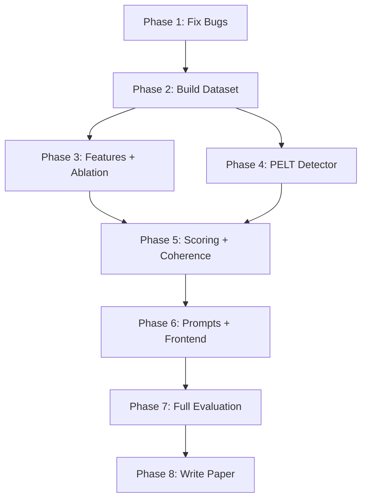

# P.R.I.S.M. v3 — Revised Implementation Plan

> **Status:** Awaiting user approval before execution.
> **Changes from V2:** Reordered phases (dataset first), reduced feature count (27 not 75), separated PELT into own module, added frontend phase, fixed scoring circularity, resolved terminology collisions. 8 phases instead of 10.

---

## Resolved Design Decisions (from V2 + new)

| # | Decision | Resolution |
|:---:|:---|:---|
| 1–18 | All V2 decisions | Unchanged |
| 19 | Char trigrams | Top 10 by document frequency from English academic corpus (not 30) |
| 20 | PELT cost function | Sweep both `rbf` (distribution shifts) AND `l2` (mean shifts) — pick winner from ablation |
| 21 | Hosting timeout | Add async job queue — return job ID, poll for results |
| 22 | Paper venue | IEEE format first (IEEE ICDM, IEEE BigData, or IEEE Access), then consider ACL/EMNLP |
| 23 | Dataset size | Start with 50 docs (fast pass), expand to 200+ after pipeline works |
| 24 | Feature count | ~27 candidates (not 75) — avoids curse of dimensionality |
| 25 | Terminology | "Stylometric Outlier" / "Temporal Anomaly" / "AI Content Flag" (not overloaded "anomaly") |

---

## Phase 1: Fix Critical Bugs

> **Goal:** Make the existing system correct.

### [MODIFY] source_tracer.py
- Re-enable dependency parser: `disable=["ner"]` (not `["ner", "parser"]`)

### [MODIFY] clustering.py
- Track semantic column names BEFORE zero-variance filtering
- Apply 0.20 weight using boolean mask, not hardcoded indices 8:11

---

## Phase 2: Build Evaluation Dataset

> **Goal:** Create labeled ground-truth corpus (50 docs first pass, 200+ final).

### [NEW] research/experiments/dataset_builder.py

**Three sources:**

| Source | Count | Labels |
|:---|:---:|:---|
| PAN 2021-2023 Style Change Detection | ~20 | Boundary positions (provided) |
| Synthetic stitched (arXiv splicing) | ~20 | Auto-generated (we know which paragraphs came from whom) |
| Genuine single-author (arXiv) | ~10 | All same-author (for false positive rate) |

**Output format:** JSON per document with `ground_truth.boundaries` and `ground_truth.author_labels`.

### [NEW] research/datasets/ directory
```
datasets/
├── pan/
├── synthetic/
├── genuine/
└── manifest.json
```

> [!IMPORTANT]
> Dataset comes BEFORE feature expansion. You can't validate features without data.

---

## Phase 3: Expand Features + Ablation (merged V2 Phases 2+5)

> **Goal:** Add ~19 new features, validate each group against dataset, select top ~20.

### [MODIFY] feature_engine.py

**Targeted feature candidates (27 total):**

| Group | Features | Count |
|:---|:---|:---:|
| Existing structural | avg_sentence_length, avg_word_length, pronoun_ratio, preposition_ratio, conjunction_ratio, passive_voice_pct, yules_k, burstiness | 8 |
| Char trigrams | Top 10 by document frequency from academic text | 10 |
| Function words | Top 5 most discriminative (the, of, and, to, in) | 5 |
| Punctuation | comma_rate, semicolon_rate, dash_rate | 3 |
| Hapax legomena | Words appearing exactly once / total | 1 |
| **Total candidates** | | **27** |

**Incremental validation workflow:**
1. Add char trigrams → run on dataset → measure F1 lift
2. Add function words → run on dataset → measure F1 lift
3. Add punctuation + hapax → run on dataset → measure F1 lift
4. Run full ablation (leave-one-group-out) → select top ~20

**Remove from feature engine:**
- OpenAI semantic embeddings (moved to topic coherence module)
- PCA reduction (no longer needed)
- Hard burstiness 0.30 threshold + 6.0 penalty (keep as soft feature)

**Add tiered extraction:**
```python
if word_count < 50: skip (INSUFFICIENT_TEXT warning)
elif word_count < 100: reduced set (char trigrams + function words + avg_sentence_length)
else: full extraction
```

### [NEW] research/experiments/run_ablation.py
- Rank features by F1 contribution
- Generate feature importance chart
- Output `SELECTED_FEATURES` config

---

## Phase 4: Add PELT Detector (Separate Module)

> **Goal:** PELT as independent module — passes the deletion test.

### [NEW] services/pelt_detector.py
```python
class PELTDetector:
    """Change-point detection on sequential paragraph features."""
    def detect(self, feature_matrix: np.ndarray, penalty: float = 1.0) -> List[int]:
        """Returns paragraph indices where style shifts occur."""
```
- Uses `ruptures` library
- Default penalty `1.0` (NOT "auto" — proper value found in ablation)
- Sweep both `model="rbf"` AND `model="l2"` in hyperparameter search
- `rbf` detects distribution shifts (variance + mean), `l2` detects mean shifts only
- **Decision from sweep:** pick whichever gets higher F1 on dataset

### [NEW] services/boundary_fusion.py
```python
class BoundaryFusion:
    """Fuses HDBSCAN and PELT boundary detections into confidence-tiered list."""
    def fuse(self, hdbscan_boundaries, pelt_boundaries, tolerance=1) -> List[TieredBoundary]:
```

**Confidence tiers:**
| HDBSCAN? | PELT? | Tier |
|:---:|:---:|:---|
| ✅ | ✅ | **HIGH** (corroborated) |
| ❌ | ✅ | **MEDIUM** |
| ✅ | ❌ | **MEDIUM** |

### [MODIFY] services/clustering.py
- Rename class: `AuthorshipClustering` → `HDBSCANDetector`
- Extract boundary detection into separate method
- Remove semantic weight hack (handled by feature engine now)

### [MODIFY] models.py
- Add `BoundaryCorroboration` enum: `HIGH`, `MEDIUM`
- Add `detection_method` field per boundary
- Rename: "confidence" → `cluster_confidence` (HDBSCAN-internal metric)

### [MODIFY] requirements.txt
- Add `ruptures>=1.1.8`

### Early benchmark
- Run HDBSCAN-only vs PELT-only vs fused on the 50-doc dataset
- Get first signal on which engine + cost function wins

---

## Phase 5: Scoring System + Topic Coherence (merged V2 Phases 6+7)

> **Goal:** Replace magic numbers with structured sub-scores. Add topic coherence.

### [NEW] services/local_embeddings.py
```python
class LocalEmbeddingService:
    """Loads MiniLM once. Shared by topic_coherence and source_tracer."""
    def embed(self, texts: List[str]) -> np.ndarray: ...
    def pairwise_similarity(self, texts: List[str]) -> List[float]: ...
```
> Prevents loading the ~500MB MiniLM model twice.

### [NEW] services/topic_coherence.py
- Uses `LocalEmbeddingService` (not its own model load)
- Adjacent paragraph cosine similarity
- Flags transitions where similarity < mean − 2σ
- Sub-score: `10 × (coherent_transitions / total_transitions)`

### [MODIFY] services/source_tracer.py
- Use `LocalEmbeddingService` instead of loading MiniLM directly

### [NEW] services/scoring_engine.py
```python
class ScoringEngine:
    """Deterministic scoring from detection outputs. No GPT dependency."""
    def score(self, boundaries, topic_coherence, citations, burstiness) -> VerdictResult:
```

**Sub-scores (each 0.0–10.0):**
| Sub-score | Computation | Offline? |
|:---|:---|:---:|
| `boundary_score` | Based on HIGH/MEDIUM boundary count | ✅ |
| `coherence_score` | % of coherent adjacent transitions | ✅ |
| `citation_score` | Temporal anomalies, density (0 weight if no citations) | ✅ |
| `burstiness_score` | Mean burstiness coefficient (soft, no threshold) | ✅ |

**Integrity = weighted average of sub-scores.** Initial equal weights. Validate qualitatively (genuine paper > 8.0, stitched < 4.0) — NOT optimized via grid search (no ground-truth scores exist).

**4-tier verdict:** Clean (8-10) / Suspicious (5-7.9) / Flagged (2-4.9) / Critical (0-1.9)

### [MODIFY] services/report_generator.py
- GPT explains the pre-computed score, does NOT compute it
- `_fallback_report()` replaced by `ScoringEngine` (always runs)
- GPT adds natural language explanation on top

### [REFACTOR] main.py → Extract PipelineOrchestrator
```python
class PipelineOrchestrator:
    def run(self, pdf_bytes, through_stage=7) -> PipelineResult:
```
- All 7 endpoints become one-liners
- Eliminates copy-pasted pipeline logic across 5 endpoints

---

## Phase 6: Update Prompts + Frontend

> **Goal:** GPT receives richer evidence. Frontend renders new data.

### [MODIFY] prompts/style_profile.py
- Include which engine(s) flagged boundary (HDBSCAN, PELT, both)
- Include boundary corroboration tier
- Include top feature deltas at boundary

### [MODIFY] prompts/report_synthesis.py
- GPT receives all sub-scores + pre-computed integrity score
- GPT explains, does NOT recompute
- Include topic coherence + dual-engine patterns

### [MODIFY] frontend/js/heatmap.js
- Support dual-engine boundary visualization
- Show corroboration tier (HIGH = solid line, MEDIUM = dashed)

### [MODIFY] frontend/js/report.js
- 4-tier verdict (was 3-tier)
- Sub-score breakdown display
- Topic coherence panel

### [MODIFY] frontend/js/charts.js
- Feature trend lines for expanded feature set

### Backend: Async job processing
- `/api/analyze` returns `{ job_id }` immediately
- New `/api/status/{job_id}` endpoint for polling
- Prevents Render 502 timeouts on long analyses

---

## Phase 7: Full Evaluation

> **Goal:** Rigorous empirical evaluation with statistical tests.

### [NEW] research/experiments/run_baselines.py

| # | System | Implementation |
|:---:|:---|:---|
| 1 | Random | Random boundary placement |
| 2 | TF-IDF cosine | Existing code |
| 3 | HDBSCAN-only | Our detector alone |
| 4 | PELT-only (rbf) | Our detector alone |
| 5 | PELT-only (l2) | Our detector alone |
| 6 | SBERT + threshold | Sentence-BERT cosine drops |
| 7 | Full P.R.I.S.M. v3 | Hybrid dual-engine + fusion |

### [NEW] research/experiments/evaluate_metrics.py
- **Primary:** F1 (boundary), ARI (clustering), document-level accuracy
- **Secondary:** WindowDiff

### [NEW] research/experiments/statistical_tests.py
- Paired bootstrap (p < 0.05)
- 95% confidence intervals
- Cohen's d for key comparisons

### [NEW] research/experiments/run_hyperparameter_sweep.py
- HDBSCAN: min_cluster_size [3,5,7,10], min_samples [2,3,5]
- PELT penalty: [0.5, 1.0, 2.0, 5.0, 10.0]
- PELT cost: [rbf, l2]
- Boundary tolerance: [0, 1, 2]
- Topic coherence threshold: [1.0σ, 1.5σ, 2.0σ, 2.5σ]

### [NEW] research/experiments/generate_figures.py
- Ablation importance chart, F1 curves, confusion matrices, PR curves

### Expand dataset to 200+ docs
- Scale up PAN + synthetic sources after pipeline is validated on 50-doc set

---

## Phase 8: Write Paper

> **Goal:** Publication-ready paper in IEEE format.

### [MODIFY] research/paper/main.tex
- Switch from ACL to **IEEE two-column format**
- Target venues: IEEE ICDM, IEEE BigData, IEEE Access
- Fallback: ACL/EMNLP workshop if IEEE doesn't fit

**Paper structure:**
1. Abstract
2. Introduction — the stitched plagiarism problem
3. Related Work — stylometry, HDBSCAN, change-point detection, PAN systems
4. System Architecture — dual-engine, feature engineering, scoring
5. Experimental Setup — dataset, metrics, baselines
6. Results — tables + figures
7. Analysis — successes, failures, why
8. Conclusion + Future Work

---

## Dependency Graph



> [!NOTE]
> Phases 3 and 4 can run in parallel after Phase 2 completes.

---

## Terminology Fixes (applied throughout)

| Old term (overloaded) | New precise terms |
|:---|:---|
| "anomaly" (3 meanings) | **Stylometric Outlier** (HDBSCAN noise), **Temporal Anomaly** (citation year), **AI Content Flag** (burstiness) |
| "confidence" (2 meanings) | **Cluster Confidence** (HDBSCAN probability), **Boundary Corroboration** (dual-engine agreement) |
| "score" (5+ meanings) | **Integrity Score**, **Burstiness Coefficient**, **Source Similarity**, **Cluster Confidence**, **Boundary Sub-score** |

---

## New Module Map

```
services/
├── pdf_parser.py              # Unchanged
├── feature_engine.py          # Expanded features, no OpenAI embeddings
├── hdbscan_detector.py        # Renamed from clustering.py
├── pelt_detector.py           # NEW — independent PELT module
├── boundary_fusion.py         # NEW — fuses both engines
├── local_embeddings.py        # NEW — shared MiniLM service
├── topic_coherence.py         # NEW — adjacent similarity
├── scoring_engine.py          # NEW — deterministic scoring
├── gpt_analyzer.py            # Unchanged (explains, doesn't score)
├── citation_forensics.py      # Unchanged
├── source_tracer.py           # Uses local_embeddings.py
├── report_generator.py        # GPT synthesis only, uses scoring_engine
└── pipeline_orchestrator.py   # NEW — extracted from main.py
```

---

## Verification Plan

| Phase | Verification |
|:---|:---|
| 1 | Run pipeline on test_stitched.pdf — verify triplets non-empty, semantic weights correct |
| 2 | Verify dataset manifest.json has ≥50 entries with ground truth |
| 3 | Ablation table shows feature importance; selected set ≤ 20 features |
| 4 | PELT detects known change points in synthetic signals; runs independently |
| 5 | Genuine paper scores > 8.0; stitched paper scores < 4.0; MiniLM loaded once |
| 6 | Frontend renders dual-engine boundaries, 4-tier verdicts, sub-scores |
| 7 | All baselines run; significance tests pass; figures generated |
| 8 | Paper compiles in IEEE format; all tables/figures reference experiment outputs |
